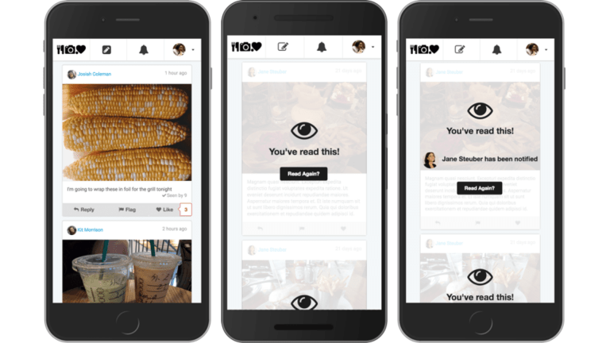

# Citation and Papers

The Truman Platform was first created in 2018 by [Dominic DiFranzo](https://difranzo.com/) and [Natalie Bazarova](https://cals.cornell.edu/natalie-bazarova) to study [bystander interventions on cyberbullying](https://dl.acm.org/doi/10.1145/3173574.3173785).

Since then, the platform has been generalized to provide social scientists a research infrastructure to explore and study a variety of research questions and topics.

Below are papers and studies that have used The Truman Platform (though not an exhaustive list) that may be helpful to understand how The Truman Platform has been used.

### Papers

Zhao, P., Bazarova, N. N., DiFranzo, D., Hui, W., Kizilcec, & Margolin, D. (2024). [Standing up to problematic content on social media: which objection strategies draw the audience’s approval?](https://doi.org/10.1093/jcmc/zmad046) _Journal of Computer-Mediated Communication_, 29(1). ([GitHub repository](https://github.com/cornellsml/truman_objection/tree/study-1-official-code), [Demo site](https://truman-objections-v1-5d359188df22.herokuapp.com/feed_no?off_id=0&obj_t_id=0&obj_m_id=0))

Agha, Z., Park, J., Wan, R., Ali, N.S., Wang, Y., DiFranzo D., Badillo-Urquiola, K., & Wisniewski, P.J. (2024). [Tricky vs. Transparent: Towards an Ecologically Valid and Safe Approach for Evaluating Online Safety Nudges for Teens.](https://doi.org/10.1145/3613904.3642313) In _Proceedings of the 2024 ACM Conference on Human Factors in Computing Systems (CHI’24)_.

Aghajari, Z., Baumer, E., Lazard, A., Dasgupta N., & DiFranzo, D. (2024). [Investigating the Mechanisms by which Prevalent Online Community Behaviors Influence Responses to Misinformation: Do Perceived Norms Really Act as a Mediator?](https://doi.org/10.1145/3613904.3641939) In _Proceedings of the 2024 ACM Conference on Human Factors in Computing Systems (CHI’24)_.

Aghajari, Z., Baumer, E., & DiFranzo, D. (2023). [What’s the Norm Around Here? Individuals’ Responses Can Mitigate the Effects of Misinformation Prevalence in Shaping Perceptions of a Community.](https://dl.acm.org/doi/10.1145/3544548.3580946) In _Proceedings of the 2023 ACM Conference on Human Factors in Computing Systems (CHI'23)_. ([GitHub repository](https://github.com/ZhilaAghajari/truman_norm), [Demo site](https://truman-socialnorms-misinfo-b5026dae9ab0.herokuapp.com/))

Bhandari, A., Ozanne, M., Bazarova, N. N., & DiFranzo, D. (2021). [Do you care who flagged this post? Effects of moderator transparency on bystander behavior.](https://doi.org/10.1093/jcmc/zmab007) _Journal of Computer-Mediated Communication_, 26(5), 284-300. ([GitHub repository](https://github.com/cornellsml/truman_content_moderation), [Demo site](https://truman-content-moderation.herokuapp.com/))

Masur, P., DiFranzo, D., & Bazarova, N. (2021). [Behavioral contagion on social media: Effects of social norms, design interventions, and critical media literacy on self-disclosure.](https://doi.org/10.1371/journal.pone.0254670) _PLoS ONE 16(7)_, e0254670. ([GitHub repository](https://github.com/difrad/social_norms_truman), [Demo site](http://truman-socialnorms.herokuapp.com/))

Taylor, S., DiFranzo, D., Choi, Y. H., Sannon, S., and Bazarova, N. (2019). [Accountability and empathy by design: Encouraging bystander intervention to cyberbullying on social media](https://dl.acm.org/doi/abs/10.1145/3359220). _Proceedings of the ACM on Human Computer Interaction Journal (PACM CHI Journal)_, 3, 1-26. ([GitHub repository](https://github.com/difrad/truman_esl_empathy), [Demo site](http://truman-esl-empathy.herokuapp.com/))

DiFranzo, D., Choi, Y.H., Purington, A., Taft, J.G., Whitlock, J., Bazarova, N.N. (2019). [Social Media TestDrive: Real-World social media education for the next generation](https://dl.acm.org/doi/10.1145/3290605.3300533). In _Proceedings of the 2019 ACM Conference on Human Factors in Computing Systems (CHI’19)_. Glasgow, UK. ([GitHub repository](https://github.com/social-media-testdrive/truman_testdrive))

DiFranzo, D., Taylor, S. H., Kazerooni, F., Wherry, O. D., & Bazarova, N. N. (2018). [Upstanding by Design: Bystander intervention in cyberbullying](https://dl.acm.org/doi/10.1145/3173574.3173785). In _Proceedings of the 2018 ACM Conference on Human Factors in Computing Systems (CHI’18)._ ([GitHub repository](https://github.com/difrad/truman_ESL_cyberbully), [Demo site](https://truman-esl-cyberbully.herokuapp.com/))

DiFranzo, D. & Bazarova, N. N. (2018). [The Truman Platform: Social media simulation for experimental research](https://socialmedialab.cornell.edu/files/2020/10/Truman_ICWSM_workshop.pdf). Workshop paper presented at The 12th International Conference on Web and Social Media (ICWSM ’18), Stanford, CA.

## Citing The Truman Platform in your research paper

You may use the following citation when citing The Truman Platform in your research paper:

DiFranzo, D. & Bazarova, N. N. (2018). [The Truman Platform: Social media simulation for experimental research](https://socialmedialab.cornell.edu/files/2020/10/Truman_ICWSM_workshop.pdf). Workshop paper presented at The 12th International Conference on Web and Social Media (ICWSM ’18), Stanford, CA

## Sharing your findings with us through email

We would love to hear about your study findings and contribution to the research community. Please email us a study report after you have completed your study to [cornellsocialmedia@gmail.com](mailto:cornellsocialmedia@gmail.com).

| [Previous Exporting Study Data](/docs/getting-started/exporting-study-data.md) | [Next Installing Truman](/docs/setting-up-truman/installing-truman/index.md) |
| --------------------------------------------------------------------------------- | ------------------------------------------------------------------------------- |
