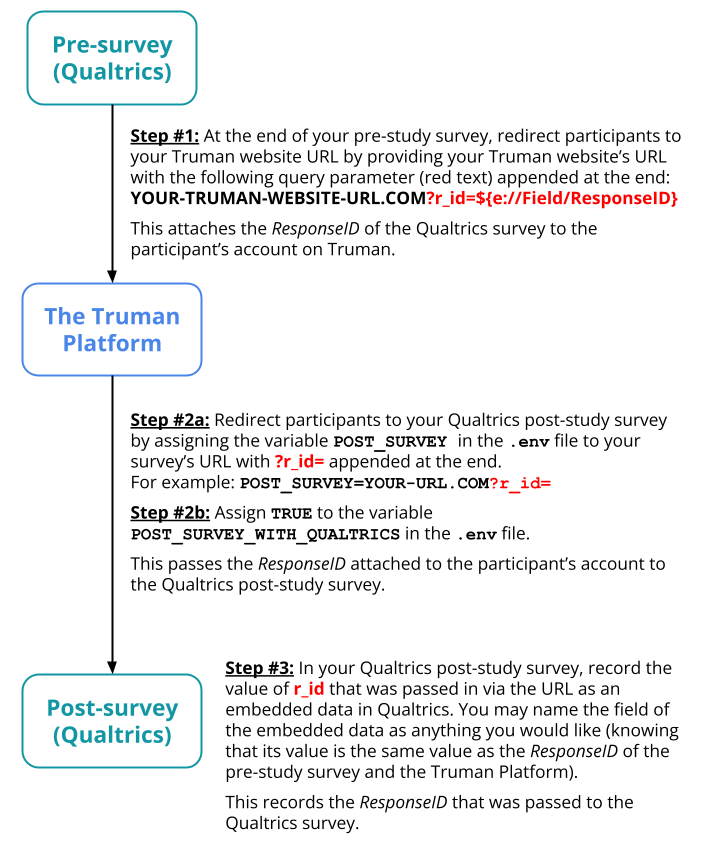

# Launching Your Study

Deploying Truman Online

After developing and testing your simulation on your local computer, you are ready to begin testing it publicly.

To test, pilot, and launch your Truman application with other people (outside of your laptop), you will need to create a public facing version of Truman, i.e. deploy your Truman application. Deploying your Truman application requires some server skills, but we have provided instructions on where and how to deploy a public facing Node.js application like Truman without much server skills.

See [Deploying Truman Online](/docs/setting-up-truman/deploying-truman-online.md) for instructions on how to deploy Truman publicly.

### Other things to change

Before deploying your application online, there may be some additional things you would like to consider changing:

- Site logo: Instructions on how to change the site logo can be found [here](/docs/setting-up-truman/defining-your-simulation/basic-simulation-components.md#how-to-change-these-components).
- Site name: Instructions on how to change the site name can be found [here](/docs/setting-up-truman/defining-your-simulation/basic-simulation-components.md#how-to-change-these-components).
- Link to your post survey: Instructions on how to change the post survey link can be found [here](/docs/setting-up-truman/defining-your-simulation/basic-simulation-components.md#how-to-change-these-components).
- Welcome page and platform community rules: You may change these in the `/views/info.pug` and `/views/com.pug` file respectively.
- The look and feel of the site: You may change these with css in the `/public/css/ui_layout.css` file.

> [!NOTE]
> It is important to modify your study’s interface (including logo, name, look, and feel of the website) sufficiently so that it does not look absolutely identical to [past Truman projects](/docs/getting-started/citation-and-papers.md#papers) (or the default EatSnap.Love cover story project).

## Testing

It is important that you test out your application before launching it as a study. Make sure you test it out with yourself and with other researchers.

Some things you want to look out for when testing include:

- salience of your experimental manipulation
- interface design issues
- technical bugs or broken functionalities
- consistency and cohesiveness of the simulation

To effectively make use of testing, try to test every experimental condition in your study for one entire duration of the study. Make sure that the condition is displaying the appropriate simulation content or interface that you want. Also, while Truman automatically manages the time scope of the study, it doesn’t hurt to double check that the simulation ends when it is supposed to end.

## Piloting

In addition to testing, it’s good to run a few pilot studies. Pilot studies are condensed/smaller versions of the actual study. They’re meant to find and sort out bugs and kinks before running the actual study with participants. They can also inform you if you need to make any necessary adjustments to your current study design. The more you test the design of the study in the beginning, the less you have to worry about problems down the line.

It is helpful to run your pilot study from beginning to end (including any pre-surveys and post-surveys). This will help guarantee that the actual study will run as smoothly as possible.

Pilot with both participants that you can meet and interview (so that you can get more information about the experience of the experiment) and with your anticipated participation pool (such as on MTurk, testing all the parts of the study on a small sample before you launch for a full study).

## Participant workflow

Below is a flowchart mapping the typical workflow of a research participant.

## Running the Study: Participant Recruitment & Qualtrics

Once you are satisfied with your simulation, it is time to run the study.

### Recruiting Participants

The easiest way to recruit research participants is through the use of crowdsourcing platforms. Amazon’s Mechanical Turk (MTurk), CloudResearch, and Prolific are some such platforms.

Using MTurk or CloudResearch, your study can be posted as a “HIT” (Human Intelligence Task) on MTurk’s database, giving you access to tens of thousands of possible participants (similarly with Prolific).

Participants can be compensated for different requirements, like payment at the time of total completion or payment for total number of hours/ days spent on the Truman instance.

Note: Participants will never interact with other participants, so their personal information is never displayed to others. It is only saved in the database, which only the researcher has access to. Passwords to their accounts are also always hashed.

### Integrating Truman with Qualtrics

It is common for researchers to launch a Truman simulation alongside a pre-study survey and a post-study survey for their study.

The pre-study survey is typically given to the research participant prior to their access of Truman and is used to gather information about the participant before they begin the study. At the end of the pre-survey, the participant is usually then directed to The Truman Platform via a provided link (your Truman application's website URL).

The post-study survey is typically given to the research participant after they have completed their study time on Truman. The post-survey is used to gather further data for the study.

When pre-study surveys and post-study surveys are used, it is essential to be able to match participant survey responses with their behavior on The Truman Platform. The Truman Platform currently has infrastructure to do this with Qualtrics.

The _ResponseID_ is an ID Qualtrics uses to identify each survey response in the database. This value is unique and automatically exported in Qualtrics datasets. This value can be passed to Truman and attached to a participant's account at initial account signup via passing the value in as a URL query parameter `r_id`(see [Passing information from a Qualtrics Survey](https://www.qualtrics.com/support/survey-platform/survey-module/survey-flow/standard-elements/passing-information-through-query-strings/#PassingInformationFromASurvey) for more information). This same value can then be passed to a post-study survey and recorded as an embedded data variable in Qualtrics as well (see [Passing information to a Qualtrics Survey](https://www.qualtrics.com/support/survey-platform/survey-module/survey-flow/standard-elements/passing-information-through-query-strings/#PassingInformationIntoASurvey) for more information).

As a result, you can then match a participant's pre-study survey response (with`ResponseID`), behavioral data on Truman (with `ResponseID`), and post-study survey response (with the variable of your embedded data) together. Below is a diagram that describes how to integrate Qualtrics with The Truman Platform and outlines this mechanism more in detail:

