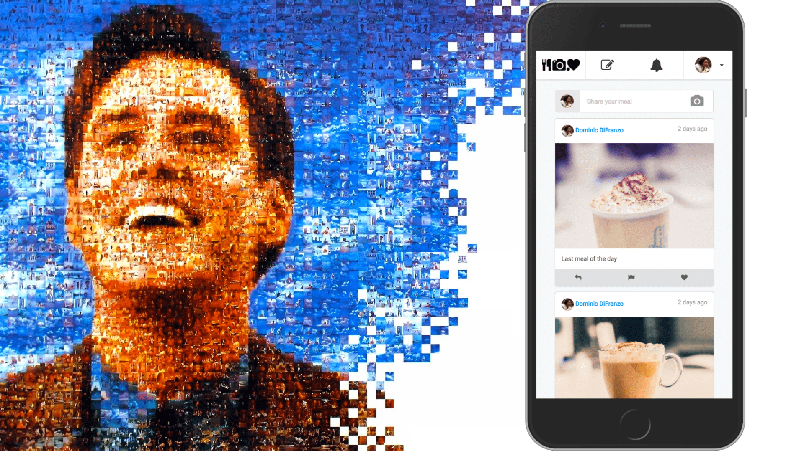

# 💻 The Truman Platform

## Introduction

The Truman Platform (Truman) is a **complete, open-source social media simulation**, which can be used as a testbed to explore different research questions.

For example, how do social norms spread on social media through a behavioral contagion process? How to encourage people to be upstanders when encountering cyberbullying? How to mitigate the effects of misinformation prevalence in social media?

## What is The Truman Platform?

Named after the 1998 film, _The Truman Show_, the Truman Platform is a social media simulation platform created by [The Cornell Social Media Lab](https://socialmedialab.cornell.edu/)
to provide researchers a community research infrastructure to conduct social media experiments in ecologically-valid realistic environments.

Researchers can create different social media environments with a repertoire of features and affordances that fit their research goals and purposes, while ensuring participants have a naturalistic social media experience.

Specifically, researchers can:

- Simulate realistic and interactive timelines and newsfeeds, by curating, creating, and controlling every "actor" (a simulated user on the website), post, like, comment, notification, and interaction that appears on the platform
  - "Actors" are fully controlled, while "Agents" are LLM-controlled
- Allow multiple participants to interact on the same feed
- Customize the social media simulation platform's interface and functionality
- Create experiments with random assignment and exposure of participants' to different experimental conditions
- Collect a variety of participant behavioral metrics on the platform (including how they interact with posts and comments, how long they are on the site, and more.)

The Truman Platform manages parallel simulations for all study participants. So, study participants don't connect or interact with any other real participant on the website, even though they believe they do, and all participants receive the same social media experience, except for variations controlled by the experimental condition of the study and the participant's own posting behavior.

As a result, The Truman Platform gives researchers lab-like control over study conditions while maintaining a realistic, naturalistic, ecologically-valid social media setting, making Truman a great tool for social scientists to study different research questions.

## Want to install Truman?

Start exploring our codebase and the steps on how to deploy your version of The Truman Platform:

[Installing Truman](/docs/setting-up-truman/installing-truman/index.md)

## Want to explore more?

Curious to see how you can use it for your experiment? Jump in to our start docs:

[Initial Experimental Design](/docs/getting-started/initial-experimental-design.md)

| [Next Initial Experimental Design](/docs/getting-started/initial-experimental-design.md) |
| ------------------------------------------------------------------------------------------- |
