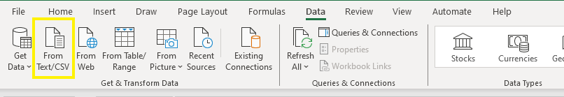
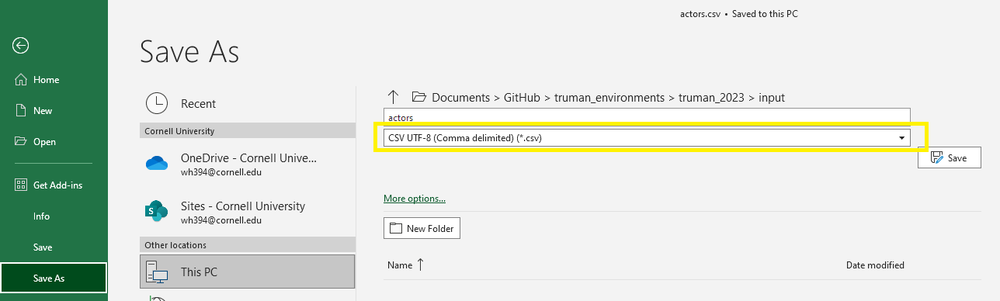

# Simulation components

## Simulation Components

There are 4 primary components to a simulation:

1.  **Actors and agents:** Actors and agents are the simulated users on the website that the participant believes are real.
    1. All interactions by Actors are fully defined by the researcher.
    2. Agents dynamically perform actions via the [Truman World LLM simulation](https://github.coecis.cornell.edu/sms-apps/truman-world), based upon instructions provided by the researcher.
2.  **Posts:** These are the simulated posts that the simulated actors have "posted"/"made", which appear on the timeline/feed.
3.  **Replies:** These are the simulated comments that the simulated actors have "posted"/"made", which appear on the timeline/feed.
4.  **Scenarios:** These define the instructions for how agents should behave in response to user actions on the timeline/feed.

### How to define the simulation components

These components are defined in the csv files found in the project file directory **`/scenarios/<scenario name>`** (e.g. `/scenarios/cyberbullying/` or `/scenarios/food/`).

Below is a breakdown of each csv, their columns, and a description of what simulation component the file defines.

> [!WARNING]
> If you change any simulation content involving pictures** (ex: actors' profile pictures or post pictures), **you will need to change the `CDN` value in the `.env` file\*\*. See the row with variable name `CDN` in the table on the [Additional simulation components page](/docs/setting-up-truman/defining-your-simulation/basic-simulation-components.md) for more information.

> [!NOTE] > **How to edit the csv files in Google Sheets (Recommended)**
>
> 1.  Import the desired csv file by navigating to File > Import > Upload File in the header of a new Google Sheet file.
> 2.  When prompted, designate where you would like to import the csv file. We recommend having a single Google Sheet file with 5 sheets (one for each csv file) for easy use and for easy collaboration with other researchers.
> 3.  When you are done editing the csv files, you will need to download each csv sheet and replace the corresponding existing one in the project file directory `**/scenarios/<scenario name>**`with your new one, ensuring the name of the file is still the same.
>
> **How to edit the csv files in Microsoft Excel**
>
> 1.  Import the desired csv file by navigating to Data > From text/CSV > Select File in the header.
>     
> 2.  When prompted on how to load the data, choose the follow values:
>     1.  File Origin: _65001: Unicode (UTF-8)_
>     2.  Delimiter: _Comma_
> 3.  Then click 'Load'. This will load the content of the csv files with emojis and other values.
> 4.  When you save the file, save the file as a CSV UTF-8 (Comma delimited) \*.csv file. To do this, go to File > Save As > Select CSV UTF-8 (Comma delimited) (\*.csv).
>     

<code>scenarios/&lt;scenario name&gt;/actors.csv</code>

The **`actors.csv`** file defines the **simulation actors**. One row in the csv file corresponds to one actor.

To define an actor, go to the `actors.csv` file. For each actor, add a new row, and define the following fields under their respective columns:

- **username** is the _unique_ username of the actor. This username is used to associate posts and behaviors with the actor. (required field)
  - Note: No 2 actors can share the same username.
- **name** is the actor's display name. (optional)
- **gender** is the actor's gender. (optional)
- **age** is the actor's age. (optional)
- **location** is the actor's location. (optional)
- **bio** is the actor's bio. (optional)
- **picture** is the file path/ file name of the actor's profile photo, relative to the folder `/profile_pictures`. See below for more information:
  - Place all actor profile photos into the `/profile_pictures` folder. When filling out the `actors.csv` file, the value that is inputted into the 'picture' column for an actor should **exactly match** the file path and file name of the same actor's profile photo, relative to the folder `/profile_pictures`. See the current csv file for examples.
  - The Truman template currently has 76 profile photos in the `/profile_pictures` folder and more to choose from in the subfolder `/profile_pictures/unused`.
- **class** can be used as a label for experimental purposes. For example, you can label certain actors as "bully" or "victim". (optional)

The Truman project food scenario currently defines 76 actors.

<code>scenarios/&lt;scenario name&gt;/agents.csv</code>

The **`agents.csv`** file defines the **simulation agents**. One row in the csv file corresponds to one agent.

To define an agent, go to the `agents.csv` file. For each agent, add a new row, and define the following fields under their respective columns:

- **username** is the _unique_ username of the agent. This username is used to associate posts and behaviors with the agent. (required field)
  - Note: No 2 agents can share the same username.
- **name** is the agent's display name. (optional)
- **gender** is the agent's gender. (optional)
- **age** is the agent's age. (optional)
- **location** is the agent's location. (optional)
- **bio** is the agent's bio. (optional)
- **behavior** are instructions for how the agent should behave. (optional)
- **picture** is the file path/ file name of the agent's profile photo, relative to the folder `/profile_pictures`. See below for more information:
  - Place all agent profile photos into the `/profile_pictures` folder. When filling out the `agents.csv` file, the value that is inputted into the 'picture' column for an agent should **exactly match** the file path and file name of the same agent's profile photo, relative to the folder `/profile_pictures`. See the current csv file for examples.
  - The Truman template currently has 76 profile photos in the `/profile_pictures` folder and more to choose from in the subfolder `/profile_pictures/unused`.
- **class** can be used as a label for experimental purposes. For example, you can label certain agents as "bully" or "victim". (optional)

The Truman project cyberbullying scenario currently defines 11 agents.

<code>scenarios/&lt;scenario name&gt;/posts.csv</code>

The **`posts.csv`** file defines the basic content of the **simulation posts** (such as the caption text, picture, actor, etc.). Simulation posts are associated with [actors](#input-actors) (the actor who creates the post). One row in the csv file corresponds to one post.

To define a post, go to the `posts.csv` file. For each post, add a new row, and define the following fields under their respective columns:

- **body** is the caption text of the post. It is displayed under the post's photo on the Truman Platform, similar to Instagram. (required field)
- **picture** is the file path/ file name of the post's photo, relative to the folder `/post_pictures`. (required field) See below for more information:
  - Place all post photos into the `/post_pictures` folder. When filling out the `posts.csv` file, the value that is inputted into the 'picture' column for a post should **exactly match** the file path and the file name of the same post's photo, relative to the folder `/post_pictures`. See the current csv file for examples.
  - The Truman template currently has about 280 photos in this folder and more to choose from in the subfolder `/post_pictures/unused`.
- **actor** is the username of the actor who "posts" this post. This value must exactly match a username value in `/scenarios/<scenario name>/actors.csv`. (required field)
- **likes** is the # of likes this post is simulated to have. If a value is not given, then a random value will be generated for the post. (optional)
- **time** is the timestamp the post should be simulated to have been posted. This timestamp is defined in reference to the moment the participant joined the website. It can be defined as before or after the participant joined using the format (+/-)HH:MM. (required field)
  - For example:
    - \-12:30 will simulate the post to have been posted \[12\] hours \[30\] minutes _before_ the participant joined the website.
    - 62:31 will simulate the post to appear \[62\]hours and \[31\] minutes _after_ the participant joined the website.
- **condition** indicates which experimental condition this post should be displayed in. If this value is left blank, this post will be displayed in **all** experimental conditions. Otherwise, this post will be displayed only participants in the defined experimental condition. Ensure that the value here exactly matches one of the experimental conditions labels as defined in the **`.env`** file variable `EXP_CONDITIONS_NAMES` (see [here](/docs/setting-up-truman/defining-your-simulation/basic-simulation-components.md) for more info).
- **class** can be used as an internal label for researcher. It is not used in the database. For example, you can label certain posts as "bully" or "victim". (optional)

Note: the _comments_ on a post are not defined here but in `scenarios/<scenario name>/replies.csv`.

<code>scenarios/&lt;scenario name&gt;/replies.csv</code>

The **`replies.csv`** file defines the **comments** on the simulation posts. One row in the csv file corresponds to one comment.

To define a comment on a post, go to the `replies.csv` file. For each comment, add a new row, and define the following fields under their respective columns:

- **body** is the text of the comment. (required field)
- **actor** is the username of the actor who "posts" this comment. This value must match a username value in `/scenarios/<scenario name>/actors.csv` exactly. (required field)
- **postID** is the ‘id’ of the post that the comment will appear on. This value must match the row of the post in `/scenarios/<scenario name>/posts.csv`. (required field)
- **likes** is the # of likes this comment is simulated to have. If a value is not given, then a random value will be generated for the comment. (optional)
- **time** is the timestamp the comment should be simulated to have been posted, relative to the moment the participant joined the website. It can be defined as before or after the participant joined using the format (+/-)HH:MM. (required field)
  - For example:
    - \-12:30 simulates the comment's posting time to be 12 hours and 30 minutes before the participant joined the website
    - 62:31 simulates the comment's posting time to be 62 hours and 31 minutes after the participant joined the website
  - When defining comments, ensure that comments always appear "after" a post is made, for continuity purposes. So for example, if a post is simulated to appear at 04:10 (4 hours and 10 minutes after a participant creates their account), all comments on this post should be simulated to appear after 04:10 (i.e. times after 04:10).
- **condition** indicates which experimental condition this comment should be displayed in. If this value is left blank, this comment will be displayed in **all** experimental conditions. Otherwise, this comment will be displayed only participants in the defined experimental condition. Ensure that the value here exactly matches one of the experimental conditions labels as defined in the **`.env`** file variable `EXP_CONDITIONS_NAMES` (see [here](/docs/setting-up-truman/defining-your-simulation/basic-simulation-components.md) for more info).
- **class** can be used as a label for experimental purposes. It is not used in the database. For example, you can label certain comments as "bully" or "victim". (optional)

<code>scenarios/&lt;scenario name&gt;/scenarios.csv</code>

The **`scenarios.csv`** file defines the social media **scenarios**. These provide feed-wide instructions for how virtual agents should behave. Mulitple users can join a session tied to a specific scenario. Each user can only be part of a single session, though each session can be tied to a different scenario. You can also have multiple sessions tied to the same scenario (e.g. you have five groups of students in a classroom all using Truman as part of an assignment, each group would have it's own session and see a separate version of the same scenario).

To define a scenario, go to the `scenarios.csv` file. For each scenario, add a new row, and define the following fields under their respective columns:

- **name** The name of the scenario. (required field)
- **description** Instructions for how the scenario should unfold. (required field)

### Populate your database with your simulation

After defining all the 3 components to the simulation using the 5 .csv files above, populate this information to the database so that the changes will be made to your simulation:

1.  Ensure all of the above .csv files are located in the `/scenarios/<scenario name>` folder with the right file name.
2.  Ensure that the `MONGODB_URI` value in your `.env` file is set to your database (See [here](/docs/setting-up-truman/installing-truman/setting-up-truman-locally.md#step-2-create-and-edit-the-environment-file-env) for instructions again. If you followed the instructions to installing Truman, this should already be set to the correct value).
3.  In your project directory in your terminal/ command prompt: enter `node populate.js scenarios/<scenario name>`. This will connect to the MongoDB database you defined in the .env file and upload the simulation data found in the csv files in the `/scenarios/<scenario name>` folder in the project directory to the MongoDB database you created. You should see green and yellow lines printed in the console indicating the progress of the database population.
4.  After it is complete, you have now completed populating your definitions for your simulation into the database! Run your project locally, visit the feed/timeline, and observe your changes!

| [Previous Basic Simulation Components](/docs/setting-up-truman/defining-your-simulation/basic-simulation-components.md) | [Next Best Practices for Simulation Building](/docs/setting-up-truman/defining-your-simulation/best-practices-for-simulation-building.md) |
| -------------------------------------------------------------------------------------------------------------------------- | -------------------------------------------------------------------------------------------------------------------------------------------- |
