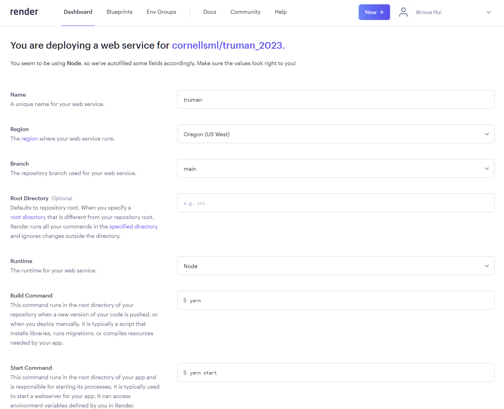
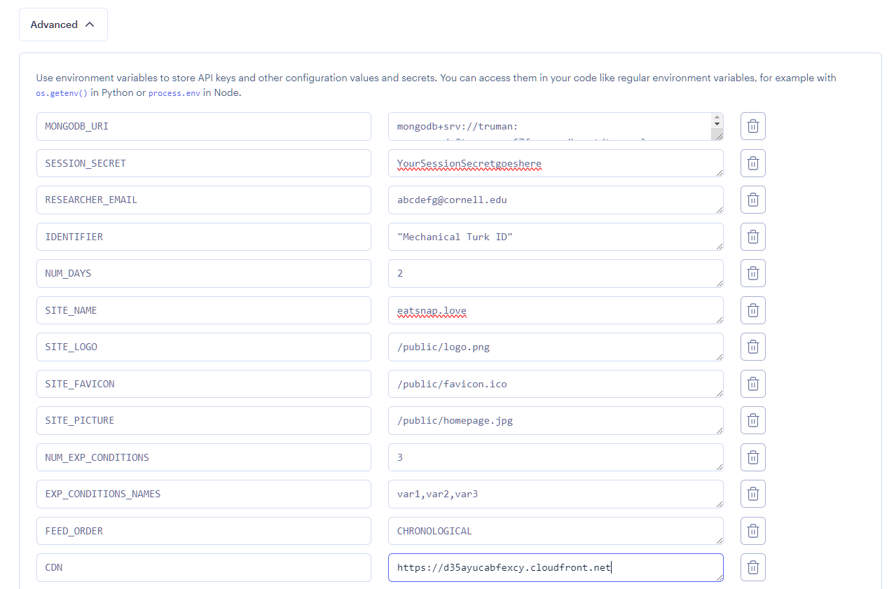
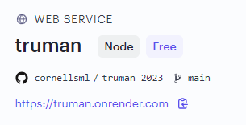
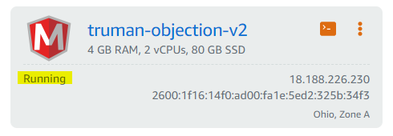
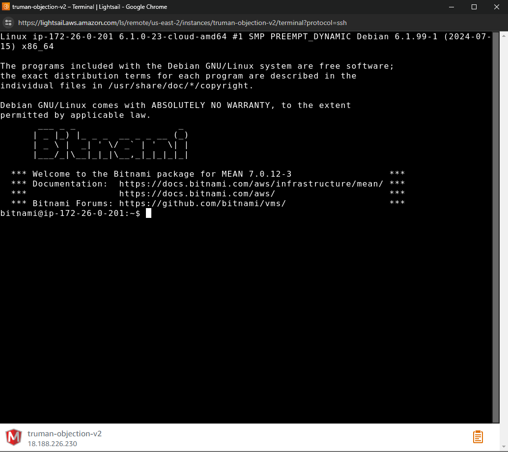

# Deploying Truman Online

After developing your simulation on your local computer, you are ready to deploy it online (to the public). This is important to do so that you can test and pilot your Truman application with other people and to launch your study.

You will need to deploy your application online to a cloud hosting platform. These are not the only choices, but are a few options to choose from.

## Deployment to Render

Render provides a free Node.js hosting option for repositories on GitHub and GitLab. Set-up is relatively seamless. However, you would likely need to

1.  Sign up for a free Individual account at [https://render.com](https://render.com/). If you use your GitHub account to sign up, you will skip the later step of linking your GitHub account to your Render account.
2.  On the dashboard, select **New Web Service** to create a new web service.
3.  When prompted **How you would like to deploy your web service?**, select **Build and deploy from a Git repository**.
4.  When prompted to **Connect a Repository**, select **Connect GitHub** and connect your GitHub account. While connecting your GitHub account, you can select which repositories you want Render to have access to. You can give Render access to all your repositories or just the repository for your Truman project.
5.  After connecting your GitHub account, choose **Connect** for the repository of your Truman project.
6.  Afterwards, you will be prompted to set up your web service.
    1.  Give your web service a **Name**. The value you assign here will appear in the default domain name provided by Render. For example, if you name your web service 'truman', then the domain name may be truman.onrender.com.
    2.  You may keep **Region**, **Branch**, and **Root Directory** as the default values provided by Render.
    3.  For **Runtime**, select **Node** from the dropdown options.
    4.  For **Instance Type**, select the **Free** instance type to launch a free web service. This is sufficient if you would like to merely run a demo or test your website. If you are planning to run a research study, you will likely need to select a paid instance type. Note: Free instance types scale down when inactive. So when the website has not been visited recently, it will take a longer time to load.
        
    5.  Open the **Advanced** settings. Here, you will add your environmental variables that were defined in your `.env` file locally. Select **Add Environment Variable**. This should trigger a row to save a **Key** and **Value**. For each environment variable in your `.env` file, add an environment variable to the interface, where the **Key** is the value to the left of the equals sign in your `.env` file and the **Value** is the value to the right of the equals sign in your `.env` file. It should look like the following:
        
    6.  When you are done, click **Create Web Service**. Your Truman application should then begin deploying. This may take a few minutes.
7.  When your application is done deploying, you should be brought to your application's dashboard and you should see (in the **Events** tab) a green cloud icon with the description "Deploy Live for..." Congratulations! Your Truman app is publicly deployed online now!
8.  To visit your Truman application, go to the URL that Render provides. It can be found at the top of the dashboard under your Web Service name and details. You should now see your Truman application.
    

## Deployment to Amazon LightSail

Amazon LightSail offers an easy way for users to get started with building and hosting their applications without much hassle. On average, it should cost about $20/ month to host your site.

The instructions below are adapted from a variety of tutorials & documentation ([link](https://www.youtube.com/watch?v=rtshCulV2hk), [link](https://www.youtube.com/watch?v=iohBEVf4uIQ), [link](https://docs.bitnami.com/aws/infrastructure/nodejs/administration/create-custom-application-nodejs/), [link](https://docs.bitnami.com/aws/how-to/generate-install-lets-encrypt-ssl/)).

### STEP 1: CREATING YOUR AWS LIGHTSAIL INSTANCE

1.  Sign up for an AWS account at [https://aws.amazon.com/](https://aws.amazon.com/) if you do not already have one. Then, sign in to your AWS account.
2.  Navigate to **AWS Lightsail** from the AWS Console Home. You can do this either 1) by going to [https://lightsail.aws.amazon.com/](https://lightsail.aws.amazon.com/) or 2) by searching for and clicking on **Lightsail** in the AWS Console Home search bar. You should be brought to AWS Lightsail’s console home.
    
3.  Create a Lightsail instance for your Truman application by clicking **Create instance**.
4.  Select the following options when creating your instance:

    1.  Under **Instance Location**: You may use the default instance location that AWS assigns, or select your own AWS region and availability zone.
    2.  Under **Pick your instance image**:

        **Select a platform:** Choose **Linux/Unix**.

        **Select a blueprint:** Choose **MEAN**.

    3.  Under **Choose your instance plan:**

        **Select a network type:** Choose **Dual-stack**

        **Select a size:** Choose an instance that matches your server requirements. In general, an instance with **4 GB Memory, 2 vCPUs Processing, 80 GB SSD Storage, and 4 TB Transfer is sufficient**. It should cost around $24/ month.

    4.  Under **Identify our instance:**

        Name your instance with an identifiable name (example: _truman-test_). You should only need to make one instance, so enter **1** in the box indicating quantity.

    5.  When you are done, click **Create instance**.

5.  It will take a few minutes for your instance to launch. When it is done launching, you should see it running on your AWS Lightsail’s console home (the text should display **Running** not **Pending…**).
    
6.  To continue setting up your instance for your application, SSH into the instance. To SSH into the instance via the AWS Lightsail console home, click the **orange square** `**>_**` **icon** of your Lightsail instance. This should bring up a popup window:
    

#### STEP 2: DOWNLOADING YOUR CODE FROM GITHUB

1.  First, clone your code from your GitHub repository to your AWS Lightsail instance:
    1.  Change directory (`cd`) into the `/htdocs` directory by entering the command `cd htdocs`
    2.  Delete the default project code in the instance by entering the command `rm -rf *`
    3.  Clone your Truman project code from GitHub by entering the command `git clone REPLACE-WITH-YOUR-GITHUB-REPOSITORY-CLONE-HTTPS-LINK` (example: `git clone https://github.com/cornellsml/truman_2023.git`). You can find this link by navigating to your GitHub repository in your browser, clicking the **green** `**<> Code**`**button**, and copying the web URL under HTTPS. If your repository is private, you may be prompted to enter your GitHub credentials. cd . Ensure that your GitHub Repository is up to date before you clone your project so that the most recent code is downloaded onto your AWS Lightsail instance.
2.  Change directory into your cloned GitHub repository by entering the command `cd REPLACE-WITH-YOUR-GITHUB-REPOSITORY-NAME` (example: `cd truman_2023`).
3.  Install your external node libraries by entering the command `npm install`. This may take a few seconds. A message will be displayed indicating if installation was successful.

#### STEP 3: SETTING UP TRUMAN

1.  Next, you will set up your MongoDB database:

    1.  Change directory into the root folder of your instance: If you are in your project directory, enter the command `cd ..`
    2.  In this directory, there is a file **bitnami_application_password** that holds the password to Mongo. To see this password, enter the command `cat bitnami_application_password`. The password should then be printed in the command prompt.
    3.  Next, using the MongoDB Shell, mongosh, log in to Mongo. Enter the command `mongosh admin --username root -p` (the username is root) You will be prompted to enter the password. Enter the printed password from the step above.
    4.  If the login is successful, you should see your cursor next to `**admin>**` .
    5.  Next, you will need to create a database that your Truman application will use. This database is similar to the database that you set up in MongoDB Atlas, but while that database was used for your local application, this new database will be used for your deployed application. It will similarly be used storing your Truman simulation information and storing your research participant’s behavioral data.
        1.  Enter the command `use REPLACE-WITH-DATABASE-NAME` (example: `use truman`).
        2.  Create a user in your database by entering the command `db.createUser({ user: “REPLACE-WITH-USERNAME”, pwd: “REPLACE-WITH-PASSWORD”, roles: [“dbOwner”]})`
            1.  This creates a user in the database with the username and password you provided, and gives this user the database owner rule (access and abilities).
            2.  The user is successfully added if you see `“{ ok: 1}”` printed in the command prompt.
    6.  To connect to the database later on, you will need the MongoDB connection URI:
        **mongodb://<username>:<pwd>@127.0.0.1:27017/<database-name>?authMechanism=SCRAM-SHA-1&authSource=<database-name>** Replace _<username>_ and _<password>_ with the username and password of the user you just created, and replace _<database-name>_ with the name of the database you created above.

        Keep this URL Connection String handy (record it somewhere, but do not share it online) as you will use it later in your application code to connect Truman to this database.

    7.  Exit the database by entering the command `exit`.

2.  Next, you will need to set up your environmental variables. These steps are very similar to the steps you followed when setting up your project locally.
    1.  `cd` (change directory) into your project folder. If you are the root folder, you may do this by entering the command `cd htdocs`. Then `cd REPLACE-WITH-YOUR-GITHUB-REPOSITORY-NAME`.
    2.  Copy the **.env.example** file to a new **.env** file by entering the command `cp .env.example .env`
    3.  Update the environment variables in your newly created **.env** file:
        1.  Enter the command `vi .env`. This opens the **.env** file in the editor.
        2.  Make sure you do not press any other keys. Only press the key **i** . This allows you to edit the file.
        3.  Afterwards, use the left and right arrow keys to navigate through the file and change your environment variables.
        4.  Replace the value of the key `MONGODB_URI=` with the URL that you just recorded earlier to tell the application which database to connect to.
        5.  Replace the value of any of the other keys with the appropriate values of your application. Since you likely have tested your application locally already, use the values you have defined in your .env file on your local computer.
        6.  Make sure that there are no spaces between the keys and their values.
    4.  Once you are done, press the **Esc** key. Then, enter `:wq!` This will save your changes and close the editor.
3.  Now you can populate your database. In your project folder, enter the command `node populate.js`. Do not close the terminal window yet (you will need it again).

#### STEP 4: SETTING UP YOUR LIGHTSAIL INSTANCE

1.  You will now need to set up the rest of your instance. Navigate back to the AWS Lightsail Console home. Click on your instance. This should bring you to your instance’s settings.
2.  Click on the tab **Networking**.
3.  Under **IPv4 Firewall**, click **Add Rule**. Create a **Custom** rule, Protocol **TCP**, Port **3000**. Then click **Create**. This should automatically create the same rule under **IPv6 Firewall**. You can delete this later.
4.  You will need to create a custom virtual host to route all traffic on port 80 and port 443 to port 3000, since that is where our Node.js application runs. The Bitnami installation comes with predefined HTTP and HTTPS virtual hosts for connecting to a Node.js application running at port 3000. To enable them, go back to the terminal window and enter the following the commands:

    1.  Copy the following files to remove the .disabled suffix: `sudo cp /opt/bitnami/apache/conf/vhosts/sample-vhost.conf.disabled /opt/bitnami/apache/conf/vhosts/sample-vhost.conf`

        `sudo cp /opt/bitnami/apache/conf/vhosts/sample-https-vhost.conf.disabled /opt/bitnami/apache/conf/vhosts/sample-https-vhost.conf`

    2.  Update the copied files with your application's directory.
        1.  Update the first file:
            1.  Enter the command `vi /opt/bitnami/apache/conf/vhosts/sample-vhost.conf`. This opens the file in the editor.
            2.  Make sure you do not press any other keys. Only press the key **i** . This allows you to edit the file.
            3.  Afterwards, use the left and right arrow keys to navigate to the line: `DocumentRoot /opt/bitnami/projects/sample`. Replace `/opt/bitnami/projects/sample` with your project root directory. Your project root directory is `"/home/bitnami/htdocs/<REPLACE-WITH-YOUR-GITHUB-REPOSITORY-NAME>"`.
            4.  Use the left and right arrow keys to then navigate to the line: `<Directory "/opt/bitnami/projects/sample">`. Similarly, replace `"/opt/bitnami/projects/sample"` with your project root directory.
            5.  Once you are done, press the **Esc** key. Then, enter `:wq!` This will save your changes and close the editor.
        2.  Update the second file:
            1.  Enter the command `vi /opt/bitnami/apache/conf/vhosts/sample-https-vhost.conf`. This opens the file in the editor.
            2.  Make sure you do not press any other keys. Only press the key **i** . This allows you to edit the file.
            3.  Similarly, use the left and right arrow keys to navigate to the line: `DocumentRoot /opt/bitnami/projects/sample`. Replace `/opt/bitnami/projects/sample` with your project root directory.
            4.  Use the left and right arrow keys to then navigate to the line: `<Directory "/opt/bitnami/projects/sample">`. Replace `"/opt/bitnami/projects/sample"` with your project root directory.
            5.  Once you are done, press the **Esc** key. Then, enter `:wq!` This will save your changes and close the editor.
    3.  Restart Apache for the changes to be taken into effect. Enter the command:
        `sudo /opt/bitnami/ctlscript.sh restart apache`

5.  Now, if you navigate back to your terminal at your project folder and enter the command `node app.js`, then your application should run publicly. You can find your application at the public IPv4 address of your AWS Lightsail instance, which can be found under **Public IPv4 address**. Copy this address and paste it into your browser. You should then be able to see your Truman application.
    

#### STEP 5: FINAL STEPS

1.  To keep your application online and always running (even when you close the terminal window), you will use PM2 (a daemon process manager). Back in your terminal in your project folder, enter the command `sudo npm install -g pm2`. This installs the package globally. Then enter `pm2 start app.js`. This starts and daemonizes your application.
2.  Now you can close your terminal and go to the Public IPv4 Address. You should be able to access your application now!
3.  (Optional, but highly recommended): We highly recommend purchasing a domain name and attaching it to your application.
4.  Congratulations, your Truman application is now publicly deployed and available!

#### STEP 6: ATTACHING A DOMAIN NAME (Optional, but highly recommended)

1.  It is recommended that you use a domain name (a web address people type into their browser to access a website) for your application so that others may easily find and access your website, to establish credibility to your site, and to allow you to install a SSL certificate with Let's Encrypt (see below) later on.
2.  You will first need to purchase a domain name if you do not already have one. Domain names can be purchased through a variety of domain registrars (ex: Namecheap, GoDaddy, SquareSpace, BlueHost, etc.). They can cost around $14-20/year, depending on the domain name you choose.
3.  After you've purchased a domain name, you will need to configure your domain name's DNS record to point to the public IPv4 address of your application. To do this, add an A record in your DNS record and route traffic of the public IPv4 address, and save.
4.  It may take about a minute for this change to propagate. Afterwards, you should be able to go to **http://YOUR-DOMAIN-NAME** and see your application.

#### Step 7: GENERATING AND INSTALLING A LET'S ENCRYPT SSL CERTIFICATE (Optional, but highly recommended)

1.  It is recommended that you use a SSL certificate (a digital certificate that verifies a website's identity and encrypts communication between a user's device and the website) for your website. This enables HTTPS, ensures secure data transmission, and builds trust with website users.
2.  The Bitnami HTTPS Configuration Tool is a command line tool for configuring mainly HTTPS certificates on Bitnami stacks and is available to use with your application. To launch this tool, enter the following command: `sudo /opt/bitnami/bncert-tool`.
3.  You will be promoted to enter the domain(s) that you are trying to obtain certificates for. Enter your domain (ex: truman.com). If you have more than one, list them all with a space separating each. Press **Enter**.
4.  The tool will ask if you'd like to include the www. domain name as well. You can if you'd like (Enter **Y**). If not, Enter **N.**
5.  Continue through the process, pressing **Enter** when prompted.
6.  When prompted **Enable HTTP to HTTPS redirection \[Y/n\]**, enter **Y**.
7.  When prompted **Do you agree with these changes?**, enter **Y.**
8.  When prompted for an email address, enter one that you would like to be contacted at and have associated with the SSL Certificate.
9.  If the generation of the certificate is successful, you will see **Success** printed in the terminal. Afterwards, you should be able to go to **https://YOUR-DOMAIN-NAME** and see your application.

## Deployment to Heroku

Heroku is also among one of the fastest ways to deploy an application without infrastructure headaches, hassle-free deployment, scaling, and management.

1.  Sign up for a free account at [https://heroku.com/](https://heroku.com/).
2.  Follow these instructions to deploy the website: [https://devcenter.heroku.com/articles/git](https://devcenter.heroku.com/articles/git).
