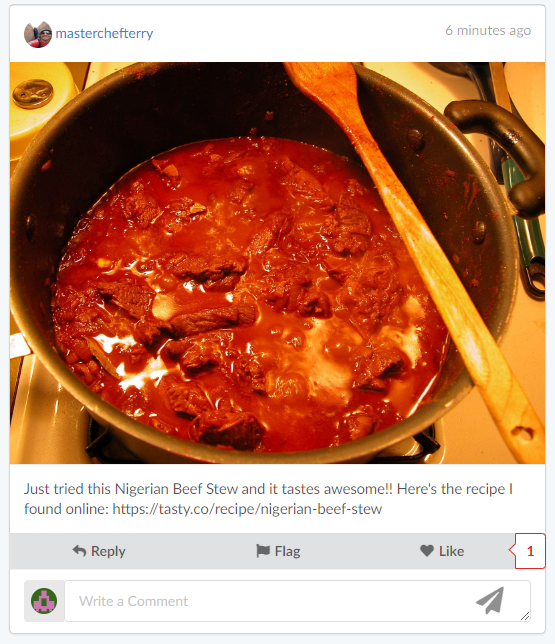
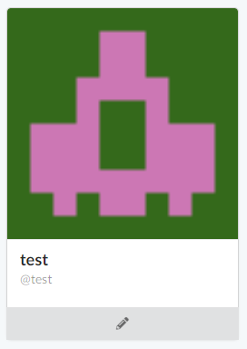

# File Directory

> [!NOTE]
> The skeleton of Truman actually comes from the outline of another Node.js project ([https://github.com/sahat/hackathon-starter](https://github.com/sahat/hackathon-starter)).

That repository has a lot of helpful and relevant information on the libraries, organization, setup, and FAQs on web development. Feel free to read through their README.md as well for a more expansive understanding of the project structure.

The Truman Platform (Truman) is a web application that uses a Node.js, MongoDB, Express.js and Pug templating engine webstack.

## The Model View Controller (MVC) framework

The project follows a basic MVC (Model View Controller) framework. The [**Model-View-Controller (MVC)**](https://www.geeksforgeeks.org/mvc-design-pattern/)
framework is an architectural/design pattern that separates an application into three main logical components: **Model**, **View**, and **Controller**. Each architectural component is built to handle specific development aspects of an application.

- The **View** components handles all the user interface logic for the application. It generates the user interface for the user.
- The **Model** components handles all the database schemas, i.e. it defines what the database "structure" looks like and defines what information is stored.
- The **Controller** components handles the interaction between the views and the models (i.e. between what appears to a user of an application and the database). The controller components act as intermediaries.
  - The controller receives input from the view, uses logic to translate the input to a demand for the model, the model grabs the data, then the controller passes data from the model back to view for the user to see in a nice display.

More information about the MVC framework can be found online if you are interested.

## Project Structure

The main node application (that defines the express server, connects to the MongoDB, and defines all the routes) is in **app.js**.

Below is a breakdown of the project files, with the name of each file and a brief description of each file's purpose.

| Name                                            | Description                                                                                                                                                                                                                                                                                                                                                               |
| ----------------------------------------------- | ------------------------------------------------------------------------------------------------------------------------------------------------------------------------------------------------------------------------------------------------------------------------------------------------------------------------------------------------------------------------- |
| **config**/passport.js                          | Passport Local and OAuth strategies, plus login middleware. Handles login authentication of email and passwords.                                                                                                                                                                                                                                                          |
| **controllers**/actors.js                       | Controller for actors.                                                                                                                                                                                                                                                                                                                                                    |
| **controllers**/chat.js                         | Controller for user chat.                                                                                                                                                                                                                                                                                                                                                 |
| **controllers**/helpers.js                      | Helper Controller methods.                                                                                                                                                                                                                                                                                                                                                |
| **controllers**/script.js                       | Controller for feed and user behavior.                                                                                                                                                                                                                                                                                                                                    |
| **controllers**/user.js                         | Controller for user.                                                                                                                                                                                                                                                                                                                                                      |
| **models**/Actor.js                             | Mongoose schema and model for Actor.                                                                                                                                                                                                                                                                                                                                      |
| **models**/Agent.js                             | Mongoose schema and model for Agent.                                                                                                                                                                                                                                                                                                                                      |
| **models**/Chat.js                              | Mongoose schema and model for Chat.                                                                                                                                                                                                                                                                                                                                       |
| **models**/Comment.js                           | Mongoose schema and model for Comment.                                                                                                                                                                                                                                                                                                                                    |
| **models**/Script.js                            | Mongoose schema and model for Script.                                                                                                                                                                                                                                                                                                                                     |
| **models**/Session.js                           | Mongoose schema and model for Session.                                                                                                                                                                                                                                                                                                                                    |
| **models**/User.js                              | Mongoose schema and model for User.                                                                                                                                                                                                                                                                                                                                       |
| **scenarios/&lt;scenario name&gt;**/actors.csv  | csv file defining the simulation actors (see [here](/docs/setting-up-truman/defining-your-simulation/simulation-components.md#input-actors))                                                                                                                                                                                                                              |
| **scenarios/&lt;scenario name&gt;**/posts.csv   | csv file defining the simulation posts (see [here](/docs/setting-up-truman/defining-your-simulation/simulation-components.md#input-posts))                                                                                                                                                                                                                                |
| **scenarios/&lt;scenario name&gt;**/replies.csv | csv file defining the simulation comments on the posts (see [here](/docs/setting-up-truman/defining-your-simulation/simulation-components.md#input-replies))                                                                                                                                                                                                              |
| **post_pictures**                               | Directory containing all the files of the post photos                                                                                                                                                                                                                                                                                                                     |
| **profile_pictures**                            | Directory containing all the files of the actor profile photos                                                                                                                                                                                                                                                                                                            |
| **public**/                                     | Static assets (fonts, css, js, img).                                                                                                                                                                                                                                                                                                                                      |
| **public**/**css**/notification.css             | Main stylesheet for notifications.                                                                                                                                                                                                                                                                                                                                        |
| **public**/**css**/script.css                   | Main stylesheet for the social media timeline / feed (ex:posts).                                                                                                                                                                                                                                                                                                          |
| **public**/**css**/ui_layout.css                | Main stylesheet for the app.                                                                                                                                                                                                                                                                                                                                              |
| **public**/**js**/actor.js                      | Client-side JavaScript for actor profile pages.                                                                                                                                                                                                                                                                                                                           |
| **public**/**js**/chat.js                       | Client-side JavaScript for chat functionality.                                                                                                                                                                                                                                                                                                                            |
| **public**/**js**/main.js                       | Client-side JavaScript for the app.                                                                                                                                                                                                                                                                                                                                       |
| **public**/**js**/postFunctionalities.js        | Client-side JavaScript specific to post interactions (ex: liking/disliking and flagging posts and comments, adding comments).                                                                                                                                                                                                                                             |
| **public**/**js**/profile.js                    | Client-side JavaScript for profile forms (on _Sign Up_ and _Update Your Profile_ pages)                                                                                                                                                                                                                                                                                   |
| **public**/**js**/script.js                     | Client-side JavaScript for feed/timeline                                                                                                                                                                                                                                                                                                                                  |
| **views**/**account**                           | Folder containing the templates to pages related to a user's/participant's account                                                                                                                                                                                                                                                                                        |
| **views**/**account**/forgot.pug                | Template for _Forgot your Password_ page                                                                                                                                                                                                                                                                                                                                  |
| **views**/**account**/login.pug                 | Template for _Login_ page                                                                                                                                                                                                                                                                                                                                                 |
| **views**/**account**/profile.pug               | Template for user's _Update My Profile_ page                                                                                                                                                                                                                                                                                                             |
| **views**/**account**/signup_info.pug           | Template for _Tell Us a Little More About Yourself_ page, shown initially upon user's sign up                                                                                                                                                                                                                                                        |
| **views**/**account**/signup.pug                | Template for _Sign_ _Up_ page                                                                                                                                                                                                                                                                                                                                             |
| **views**/**partials**                          | Folder containing the templates of partial components.  These components are not complete pages, but rather components of the interface that appear in multiple places or repeatedly. Defining the components in one file and then including it with the code "include <filename>" when needed reduces code redundancy and maintains consistency across components. |
| **views**/**partials**/post.pug                 | Partial template for a post                                                                                                                                                                                                                                                                                                                                  |
| **views**/**partials**/chat.pug                 | Partial template for a chat messag                                                                                                                                                                                                                                                                                                                                        |
| **views**/**partials**/ui_flash.pug             | Partial template for error, info and success flash notifications.                                                                                                                                                                                                                                                                                       |
| **views**/**partials**/ui_header.pug            | Partial template for header (navigation bar)                                                                                                                                                                                                                                                                                                           |
| **views**/**partials**/userCard.pug             | Partial template for user card (displayed on timeline and displayed on user's _Profile_ page)                                                                                                                                                                                                                                                            |
| **views**/actor.pug                             | Template for an actor's Profile                                                                                                                                                                                                                                                                                                                            |
| **views**/actors.pug                            | Template for the _Actor Directory_ page. Only accessible to admin users.                                                                                                                                                                                                                                                                                  |
| **views**/actors/new.pug                        | Template for the new Actor page. Only accessible to admin users.                                                                                                                                                                                                                                                                                                          |
| **views**/com.pug                               | Template for the _Community Rules_ page.                                                                                                                                                                                                                                                                                                                     |
| **views**/completed.pug                         | Template for the _Completed_ page.                                                                                                                                                                                                                                                                                                                                        |
| **views**/error.pug                             | Template for the _Error_ page.                                                                                                                                                                                                                                                                                                                             |
| **views**/info.pug                              | Template for the _Welcome to EatSnap.Love!_ page                                                                                                                                                                                                                                                                                                            |
| **views**/script.pug                            | Template for the _Timeline/Feed_ page                                                                                                                                                                                                                                                                                                                     |
| **views**/test.pug                              | Template for the _Test Timeline/Feed_ page (same as above). Can be used for testing purposes.                                                                                                                                                                                                                                                                             |
| **views**/tos.pug                               | Template for the _Terms of Services_ page                                                                                                                                                                                                                                                                                                                    |
| **views**/ui_layout.pug                         | Base template. All templates extends (or are based off of) this template.                                                                                                                                                                                                                                                                                                 |
| .dockerignore                                   | Folder and files ignored by docker usage.                                                                                                                                                                                                                                                                                                                                 |
| .editorconfig                                   | [Editor config](https://editorconfig.org) settings.                                                                                                                                                                                                                                                                                                                       |
| .env.example                                    | Example template of .env file (to be copied and Your API keys, tokens, passwords and database URI.                                                                                                                                                                                                                                                                        |
| .env                                            | Environment variables file, where [database URI](/docs/setting-up-truman/installing-truman/setting-up-truman-locally#step-2-create-and-edit-the-environment-file-.env) and [other simulation components](/docs/setting-up-truman/defining-your-simulation/basic-simulation-components) are defined.                                                                       |
| .gitignore                                      | Folder and files ignored by git.                                                                                                                                                                                                                                                                                                                                          |
| .husky                                          | Folder for [Husky](https://typicode.github.io/husky/) git commit hooks (e.g. auto formats files on commit).                                                                                                                                                                                                                                                               |
| .prettierignore                                 | Files ignored by [Prettier](https://prettier.io) (a code auto formatter)                                                                                                                                                                                                                                                                                                  |
| .prettierrc                                     | Configuration for [Prettier](https://prettier.io) (a code auto formatter)                                                                                                                                                                                                                                                                                                 |
| app.js                                          | The main application file.                                                                                                                                                                                                                                                                                                                                                |
| data-export.js                                  | JavaScript file that exports basic user information for each user on the site, into a readable csv file.                                                                                                                                                                                                                                                                  |
| docker-compose.yml                              | Docker compose configuration file.                                                                                                                                                                                                                                                                                                                                        |
| Dockerfile                                      | Docker configuration file.                                                                                                                                                                                                                                                                                                                                                |
| docs                                            | Folder containing these docs.                                                                                                                                                                                                                                                                                                                                             |
| eslint.config.js                                | Configuration for [ESLint](https://eslint.org), a tool to help find and fix JavaScript code issues.                                                                                                                                                                                                                                                                       |
| package.json                                    | NPM dependencies.                                                                                                                                                                                                                                                                                                                                                         |
| package-lock.json                               | Contains exact versions of NPM dependencies in package.json.                                                                                                                                                                                                                                                                                                              |
| populate.js                                     | JavaScript file that populates the database with the csv files in the `scenarios/<scenario name>` folder.                                                                                                                                                                                                                                                                 |
| addNewAdmin.js                                  | JavaScript file that creates a new Admin account.                                                                                                                                                                                                                                                                                                                         |

**Below are libraries that Truman uses and references to each library’s documentation.**

**Pug.js:** [https://pugjs.org/api/getting-started.html](https://pugjs.org/api/getting-started.html)

- Why do we use Pug?
  - Pug.js is a templating language rather than raw HTML. Most sites use some kind of templating language rather than raw HTML.
  - Using a templating language decreases the likelihood of bugs and security risks. It also is easier to write code in this templating language than in raw HTML.

**Fomantic UI:** [https://fomantic-ui.com/](https://fomantic-ui.com/)

- Fomantic UI is a front-end development framework that helps create beautiful, responsive layouts using human-friendly HTML. Almost all of our components are borrowed and customized from Fomantic UI.

| [Previous Frequently Asked Questions](/docs/setting-up-truman/defining-your-simulation/frequently-asked-questions.md) | [Next Deploying Truman Online](/docs/setting-up-truman/deploying-truman-online.md) |
| ------------------------------------------------------------------------------------------------------------------------ | ------------------------------------------------------------------------------------- |
