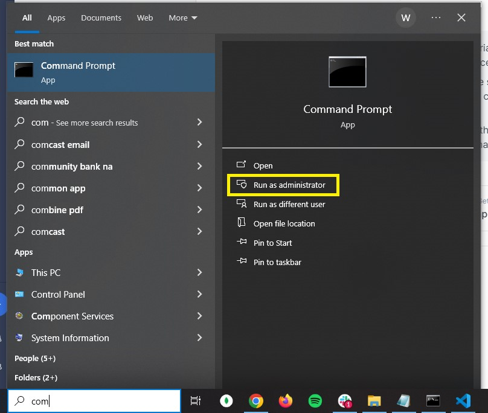

# Installing Truman

The Truman Platform (Truman) is a web application that uses the Node.js framework.

The following pages will help walk you through:

1.  Installing the prerequisite software for running Truman,
2.  Creating your own project codebase and MongoDB database, and
3.  Setting up a local version of your project on your local computer.

At the very end of the tutorial, you should have a running version of the project on your local computer.

> [!NOTE]
> Throughout this tutorial, you will be using the Terminal (for Mac) or the Command Prompt (for Windows). To access these:
>
> - On **Mac:** Click the search “magnifying glass” icon at the top right of your desktop (or use the shortcut: command + spacebar to open up the search field), and enter “terminal” into it and select it.
>   
> - On **Windows:** In the Windows search bar, enter "Command Prompt" and select "Run as administrator".
>   
