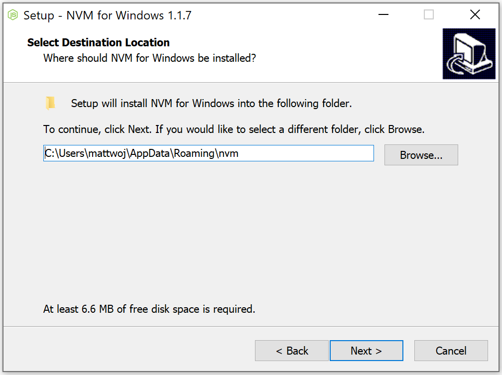

# Installing the prerequisites

Before beginning to use Truman, you will need to download all the prerequisite software necessary for running Truman on your local device.

Below is a list of all the software you will need to download:

1.  [Homebrew](#homebrew-mac-only)
    (Mac Only)
2.  [Node Version Manager (nvm)](#node-version-manager-nvm)
3.  [Node.js and Node Package Manager (npm)](#nodejs-and-node-package-manager-npm)
4.  [GitHub Desktop](#github-desktop)
5.  [Visual Studio Code](#visual-studio-code)

The instructions on how to install each prerequisite can be found below.

## Homebrew (Mac Only)

Follow the instructions here to install Homebrew: [http://brew.sh](http://brew.sh).

Homebrew is a free and open-source software package management system, and it simplifies software installation on Apple's macOS. You will use Homebrew in the later steps to install the rest of the required software.

This does not work for Windows.

## Node Version Manager (nvm)

Node Version Manager (nvm) allows you to install multiple versions of Node.js and to easily change between the versions. This is extremely useful if you use different versions of Node.js for different projects (for example: one project runs Node.js v.14.16.0, while another projects runs Node.js v.10.16.0).

If you already have Node.js installed on your local computer and you do not want to use a node version manager, you can skip this step. Otherwise, follow the instructions below.

1.  First, check if Node.js is already installed by entering the following command in the terminal/command prompt: `node --version` If a version number is printed in the terminal/command prompt (ex: something like v10.16.0 will appear), it means you have Node.js installed. You will need to uninstall it.
2.  To uninstall:

<b>Mac/Linux</b>

Enter the following command in the terminal:

Uninstall any versions of Node.js you currently have:

Copy

    brew uninstall --force node

<b>Windows</b>

Follow the instructions in the first answer here: [https://stackoverflow.com/questions/20711240/how-to-completely-remove-node-js-from-windows](https://stackoverflow.com/questions/20711240/how-to-completely-remove-node-js-from-windows).

3.  Then, install nvm.

<b>Mac/Linux</b>

Enter the following commands in the terminal:

Install NVM via Homebrew:

Copy

    brew install nvm

Create NVM's working directory if it doesn't exist:

Copy

    mkdir ~/.nvm

Add the following to your shell profile e.g. ~/.profile or ~/.zshrc:

Copy

    export NVM_DIR="$HOME/.nvm"
        [ -s "$HOMEBREW_PREFIX/opt/nvm/nvm.sh" ] && \. "$HOMEBREW_PREFIX/opt/nvm/nvm.sh" # This loads nvm
        [ -s "$HOMEBREW_PREFIX/opt/nvm/etc/bash_completion.d/nvm" ] && \. "$HOMEBREW_PREFIX/opt/nvm/etc/bash_completion.d/nvm" # This loads nvm bash_completion

<b>Windows</b>

1.  Download the **nvm-setup.zip** file for the most recent release [here](https://github.com/coreybutler/nvm-windows/releases).
2.  Once downloaded, open the zip file, then open the **nvm-setup.exe** file.
3.  The Setup-NVM-for-Windows installation wizard will walk you through the setup steps, including choosing the directory where both nvm-windows and Node.js will be installed.

4.  Confirm you have NVM installed by entering `nvm -v` in the terminal/command prompt. A version number should be printed if it has been installed properly.

## Node.js and Node Package Manager (npm)

Node.js is a server-side JavaScript runtime environment built on top of Google Chrome V8 JavaScript engine. It allows JavaScript code to run outside of a web browser and on a server, and therefore is typically used to easily and quickly build web applications on the server-side (back end).

Node Package Manager (npm) is the standard package manager for Node.js that makes downloading and managing the dependencies of Node.js packages easy.

It is not too important to understand what both of these things do.

If you already have Node.js installed on your local computer, you can skip this step. Otherwise, follow the instructions below.

> [!NOTE]
> Truman was created in 2019 with Node.js v.10.x.x. Since then, it has had a few updates. The most recent version of Truman runs on Node.js v.18.17.0, so we will install Node.js v.18.17.0.

1.  To install Node.js v.18.17.0, enter the following command in the terminal/command prompt: `nvm install 18.17.0` If it installed properly, you should see "Installation complete. If you want to..." printed in the terminal/command prompt.
2.  Then, tell the computer to use Node.js v.18.17.0 by entering the following command in the terminal/command prompt: `nvm use 18.17.0`

## GitHub Desktop

Git is a version control system that tracks changes in computer files. It is typically used to coordinate work among programmers who are collaboratively developing source code during software development. GitHub Desktop is an application that provides an easy interface to use Git.

If you already have a workflow for pulling/pushing code from GitHub, you can skip this step. Otherwise, follow the instructions below.

1.  Download GitHub Desktop here: [https://desktop.github.com/](https://desktop.github.com/).
2.  In your computer's `Downloads` folder, double-click the **GitHub Desktop** **setup** file. This will install the application.
3.  GitHub Desktop will launch after installation is complete. It will prompt you to sign in to your GitHub account. If you do not have a GitHub account, sign up for one [here](https://github.com/).
4.  After signing into your GitHub account, you will be prompted by the application to allow access to your GitHub repositories. Allow access to all repositories (Public and Private) and then click the green **Authorize desktop** button.

## Visual Studio Code

Visual Studio Code is a source-code editor, making it easier to make changes to the code in the codebase.

If you already have a source-code editor that you use to (like Atom, Sublime Text), you can skip this step. Additionally, if you do not plan to make any changes to the code, you can also skip this step.

1.  Follow the instructions here to download Visual Studio Code: [https://code.visualstudio.com/](https://code.visualstudio.com/).

| [Previous Installing Truman](/docs/setting-up-truman/installing-truman/index.md) | [Next Setting Up Truman Locally](/docs/setting-up-truman/installing-truman/setting-up-truman-locally.md) |
| ----------------------------------------------------------------------------------- | ----------------------------------------------------------------------------------------------------------- |
