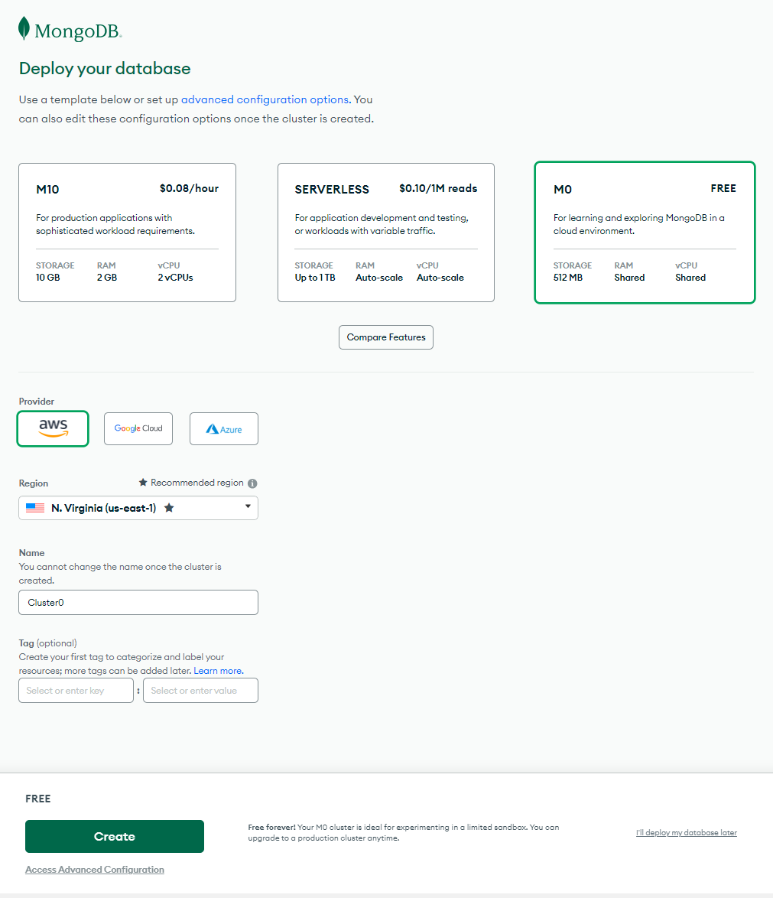
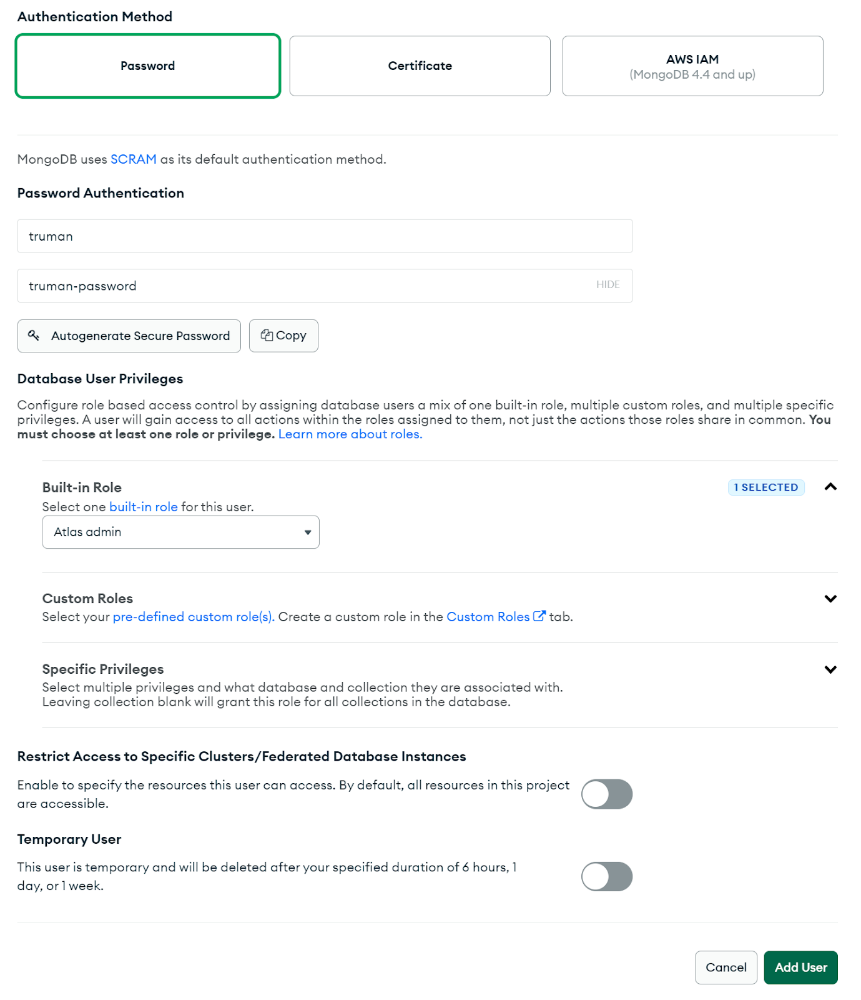
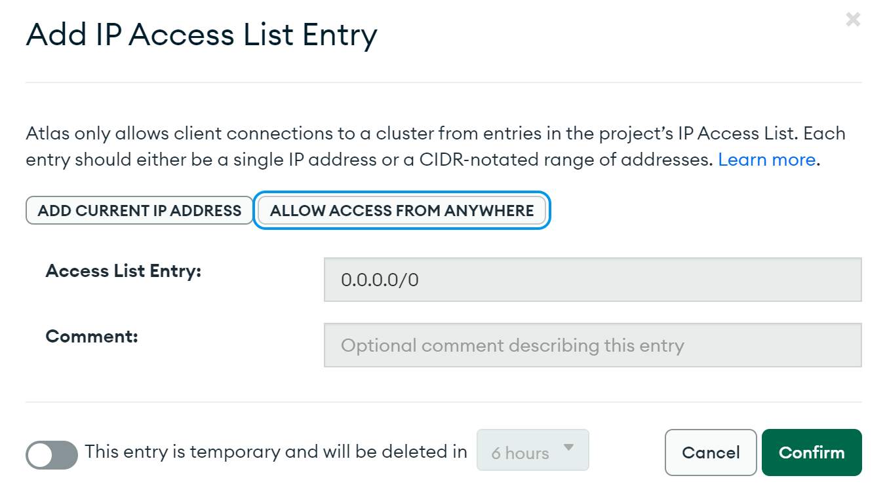
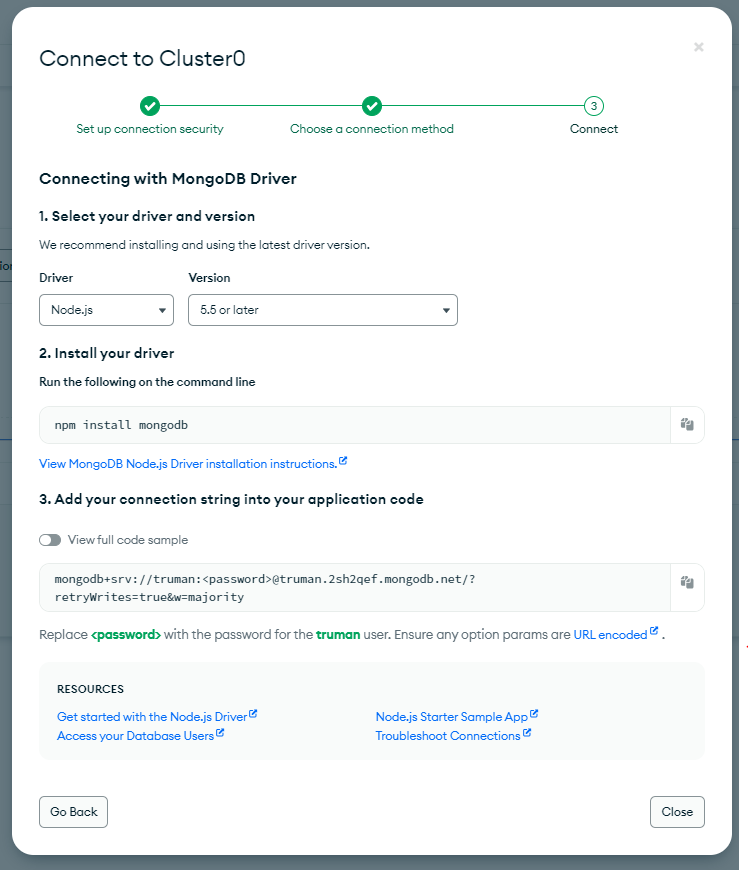
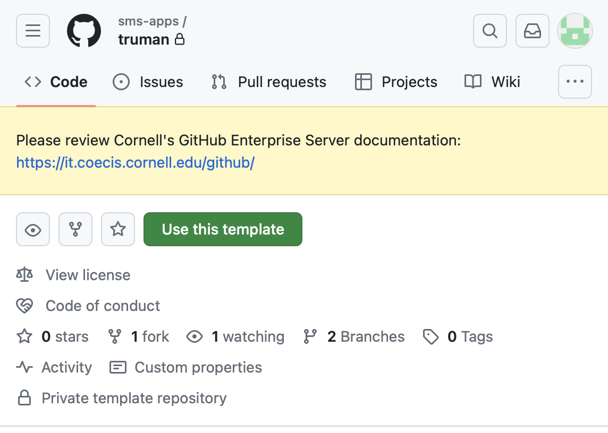
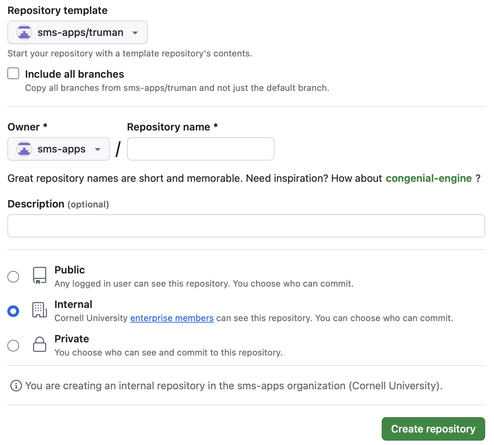
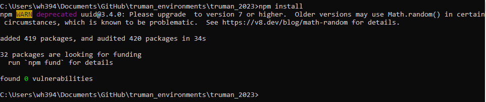
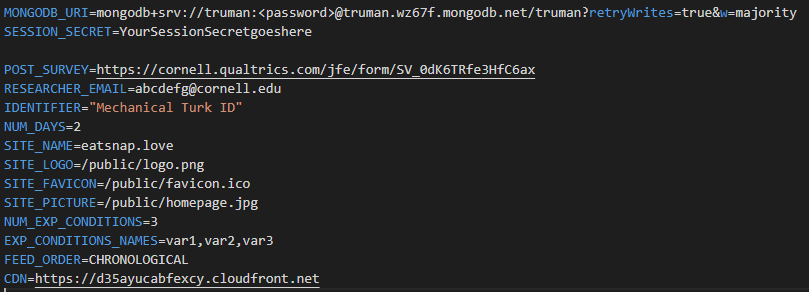
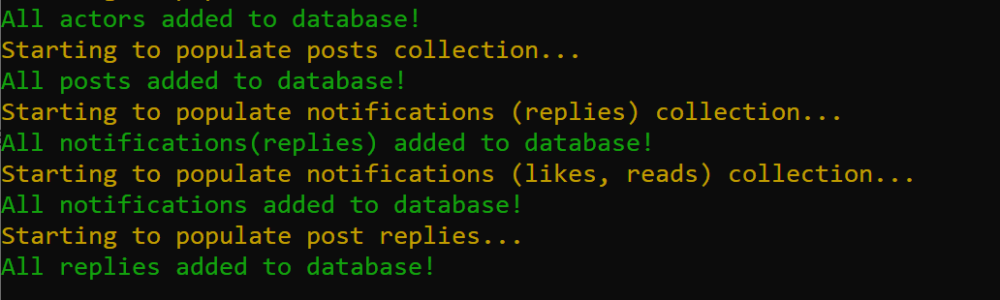

# Setting up Truman locally

The following steps will guide you through how to set up your own version of The Truman Platform. At the end, you should have a running version of the project on your local computer.

Below is a brief overview of the steps you will take to set up Truman locally:

1. [Creating a MongoDB database instance](#creating-a-mongodb-database-instance)
2. [Downloading the code from GitHub](#downloading-the-code-from-github)
3. [Setting up Truman](#setting-up-truman)

The instructions for each step are outlined below.

## Creating a MongoDB database instance

The Truman Platform uses MongoDB as its database system. It is where participant data, simulation data, and more is stored.

MongoDB Atlas is a managed cloud database service that hosts MongoDB databases. We will be using MongoDB Atlas to easily set up a free MongoDB database.

### Step 1: Create an account on MongoDB Atlas

1.  Go to [https://www.mongodb.com/atlas/database](https://www.mongodb.com/atlas/database).
2.  Click the green **Try Free** button in the top right of the header.
3.  Sign up for an account by filling in your new account information and then clicking the **Create your Atlas account** button. After verifying your account, sign into your new account.
4.  Upon signing in, you should be directed to the **Database Deployments** page.

### Step 2: Create a MongoDB database

1.  Click the green **Build a Database** button. You will be redirected to a selection page.
    1. Choose the free database available.
    2. Choose AWS as the provider.
    3. Choose a region within the United States (ex: 'N. Virginia (us-east-1)').
    4. Give your Cluster a name (ex: 'truman'; the default is 'Cluster0').
    5. You do not need to change any of the other selected default options.
    6. Click on the green **Create** button.
       
2.  Wait for a while as your cluster is created (might take 5-8 minutes).
3.  After the cluster is created, you will be redirected to the **Security Quickstart** page. Instead of defining Database Access and Network Access here, we will do it another way.
4.  First, create a new MongoDB user.
    1. Navigate to **Security** \> **Database Access** via the left navigation panel.
    2. Click the green **Add a New Database User** button.
    3. Choose the authentication method: **Password**.
    4. Under Password Authentication, create a username and password for the MongoDB User. You will need to remember both of these values.
    5. Under **Database User Privileges**, choose the built in role: **Atlas Admin**.
    6. You do not need to complete or select anything else. Click the green **Add User** button.
       
5.  Afterwards, you will set up Network Access to your database.
    1. Navigate to **Security** \> **Network Access** via the left navigation panel.
    2. Click the green **Add IP Address** button.
    3. Click **Allow Access from Anywhere**. This will add 0.0.0.0/0 to the field **Access List Entry**. Click **Confirm** to save the 0.0.0.0/0 whitelist.
       
6.  Afterwards, navigate to the Clusters page by clicking **Deployment** \> **Database** via the left navigation panel. Then, click on the **Connect** button under the name of your cluster (the default name was Cluster0, if you did not change it). A screen should then appear.
    
7.  Under **Connect Your Application**, choose the connection security **Drivers**.
8.  In the new screen:
    1. Select **Node.js** as the Driver and Version **5.5 or later** in Step 1.
    2. Ignore Step 2.
    3. Copy the URL Connection String in Step 3. Then:
       1. Replace _<password>_ in this connection string with the password you used when creating the MongoDB user in Step 4 earlier (hint: replace ALL of <password>, including the < and > with the value of your password).
       2. Between the backslash ('/') and question mark ('?'), insert the name of your cluster (the default name was Cluster0, if you did not change it).
       3. Keep this URL Connection String handy (record it somewhere, but do not share it online) as you will use it later in your application code to connect Truman to this database.
          
9.  (optional) Download [MongoDB Compass](https://www.mongodb.com/products/tools/compass)
    1. MongoDB Compass is the GUI for MongoDB. It is a free interactive tool that lets you easily see the objects/data in the database. It is also helpful for querying, optimizing, and analyzing MongoDB data.
    2. This is an optional step only if you want to easily see the objects in the database, which is helpful for testing purposes (you can skip this step if you would like).

## Downloading the code from GitHub

The most recent codebase for The Truman Platform can be found here: [https://github.coecis.cornell.edu/sms-apps/truman](https://github.coecis.cornell.edu/sms-apps/truman).

This repository contains the most recent code (last updated in March 2025), which includes a variety of updates since the original project (which was created in 2019). We recommend using this repository.

However, if you would like to use the original project repository, you can find it here: [https://github.com/cornellsocialmedialab/truman_2023](https://github.com/cornellsocialmedialab/truman_2023).

### Step 1: Create your own Truman repository (codebase) using the most recent codebase

You will use the Truman codebase as a template to create your own code repository of Truman. This allows you to create your own projects without affecting the main Truman source code.

1.  Go to [GitHub](https://github.com/), and sign into your account.
2.  Then, go to [https://github.coecis.cornell.edu/sms-apps/truman](https://github.coecis.cornell.edu/sms-apps/truman).
3.  Click the green button that says **Use This Template**.
    
4.  You should be redirected to a new page with a form to create a new repository. Complete this form:
    1. Give your repository a name (for example: "truman-socialnormsproject").
    2. Set a description for your repository (optional).
    3. Change the visiblity of the repository (optional).
    4. Click **Create repository**.
       

You now have your own version of Truman on your own GitHub account!

### Step 2: Cloning your Truman project onto your local computer

Now that you have a version of Truman on your own GitHub account, clone this codebase onto your local machine. Cloning creates a local copy of the code on your own laptop.

Having a local copy of the code on your laptop allows you to make changes to the code and test and observe them locally before pushing them publicly to the repository or for deployment.

1.  For instructions on how to clone your repository, see [here](https://docs.github.com/en/repositories/creating-and-managing-repositories/cloning-a-repository).
    You can either use (1) the terminal/command prompt (as seen in the above instructions) or (2) the GitHub Desktop application, which you downloaded earlier (see [here](https://help.github.com/en/desktop/contributing-to-projects/cloning-a-repository-from-github-to-github-desktop)
    for instructions on how). If you are unfamiliar with using the terminal/command prompt, we recommend using the GitHub Desktop application.
2.  Be sure to remember which file directory you cloned the repository to on your local computer.

## Setting up Truman

Now that you have a local copy of the Truman codebase on your own laptop, we will complete some steps and configuration to get it running.

### Step 1: Install the project package dependencies

1.  Open the terminal/command prompt.
2.  `cd` (change directory) into the file directory you cloned the repository to by entering the command `cd <file-directory-path>` and replacing `<file-directory-path>` with the file directory path. For example, if you cloned the repository into C:\\Users\\JohnDoe\\Documents\\GitHub\\truman you would enter `cd C:\Users\JohnDoe\Documents\GitHub\truman` in the terminal/command prompt.
3.  Next, enter `npm install` in the terminal/command prompt. This installs all the external node libraries for Truman . You are going to see a bunch of lines of code come and go on the screen. This is completely normal. This may take a few minutes as the project needs to download and install a lot of libraries. Afterwards, you should see a screen similar to the one below, with a message like “added XXXX packages….”, indicating the installation was successful. Note: If the installation prompts you to update npm, you can update npm. However, it is not necessary.
    

### Step 2: Create and edit the environment file (.env)

The purpose of the **.env** (environment) file is to locally store environment-specific variables (with the format KEY=VALUE) on the machine rather than on the cloud server. This is important for sensitive information such as the MongoDB connection string, since we don't want to be visible to the public or else others could have access to the database.

An example **.env** file is provided in the codebase (**.env.example**) to help you create this .env file. You will now create the **.env** file and add the MongoDB URL connection string that you saved earlier. This will connect your project with the database you created earlier.

1.  Copy the **.env.example** file:

<b>Mac/Linux</b>

1. Enter the following command in the terminal (in the file directory of your project): `cp .env.example .env` This creates a copy of the file **.env.example** to **.env**.
2. You should now have a **.env** file, with all the environment variables in the .env.example copied over.

<b>Windows</b>

1. Enter the following command in the command prompt (in the file directory of your project): `copy .env.example .env` This creates a copy of the file **.env.example** to **.env.**
2. You should now have a **.env** file, with all the environment variables in the .env.example copied over.

> [!NOTE]
> DO NOT copy the **.env.example** file by copying, pasting, and renaming the file in the File Directory/Explorer. You will encounter errors if you do this.

2.  Update the environment variables (specifically the MongoDB URL connection string) in your newly created **.env** file:

<b>Mac/Linux</b>

1. Edit the .env file with nano by entering `nano .env` in the terminal.
2. Replace the value of the key **MONGODB_URI=** with the URL that you recorded down earlier to tell the application which database to connect to (i.e. replace the value to the right of the equals signs with the connection string; see the screenshot below as an example). Make sure that there are no spaces between the key and the connection string.
3. Exit the nano window with **CTRL+X.**
4. Before exiting, you will be asked if you want to save your changes to the file. Press **Y** and hit **Enter** to save.
5. Next, you will be asked to give the file a name. You do not need to give the file a new name, so simply hit **Enter** again.

<b>Windows</b>

1. Edit the .env file with a text editor by entering `.env` in the command prompt. This should open the file in a text editor.
2. Replace the value for the key **MONGODB_URI=** with the URL that you recorded down earlier to tell the application which database to connect to. Make sure that there are no spaces between the variable and the connection string. (See screenshot below).
3. Then save the file.

### Step 3: Populate your database

Now that you have indicated in your project which database to connect to, it is time to populate the database with the simulation content.

1.  Enter `node populate.js` in the terminal/command prompt. This command runs the script **populate.js**, which connects to the MongoDB database you just defined in the **.env** file and uploads the simulation data found in the csv files in the **./input** folder in the project directory to the MongoDB database you created.
2.  You should see something printed similar to this.
    
3.  After the script is done running, go to [https://cloud.mongodb.com/](https://cloud.mongodb.com/) to look at the database you just populated.
    1.  Click **Database > Clusters** via the left navigation panel.
    2.  Click on the name of your cluster (the default name was Cluster0, if you did not change it).
    3.  Under Collections, you should now see 3 new collections in your database, called “actors”, “scripts”, “notifications”. These are the objects that form the simulation (actors, posts, comments, notifications etc.)
        

> [!NOTE]
> If you downloaded MongoDB Compass earlier (an optional step), you can also view your database via MongoDB Compass. This may be an easier interface to use than the web browser interface if you plan to manipulate and check the objects in your database often:
>
> Open MongoDB Compass on your local machine. When it prompts you to enter a connection string, enter your MongoDB Connection String and click **Connect**. You should then see a very similar interface as the picture above.

## Using Truman for the first time!

1.  Now that everything is installed, we can now run Truman on your local device! Enter `npm run dev` in the terminal/command prompt. This starts your server.
2.  Then, go to **http://localhost:3000/** in the browser of your choice.
3.  You should be able to see a screen like the one below.
4.  Congratulations! You now have your own version of Truman running on your local computer! Create a new account and try out Truman for yourself.
    

| [Previous Installing the Prerequisites](/docs/setting-up-truman/installing-truman/installing-the-prerequisites.md) | [Next Defining Your Simulation](/docs/setting-up-truman/defining-your-simulation/index.md) |
| --------------------------------------------------------------------------------------------------------------------- | --------------------------------------------------------------------------------------------- |
